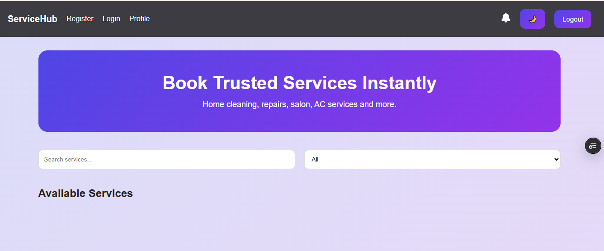
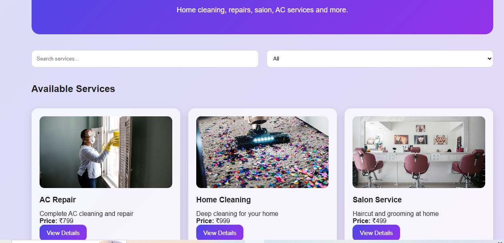
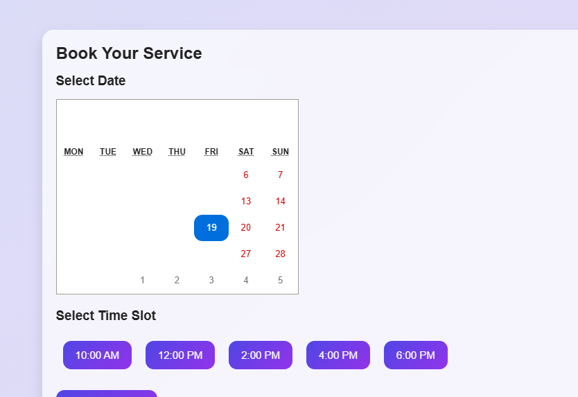
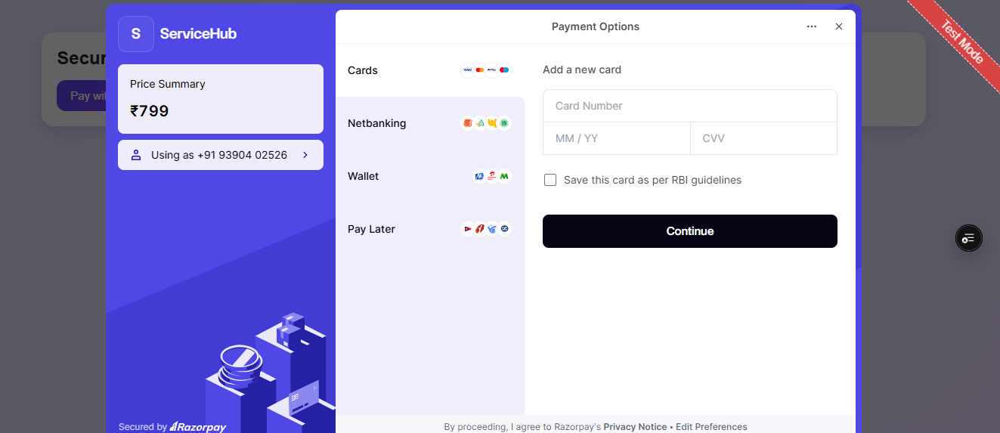
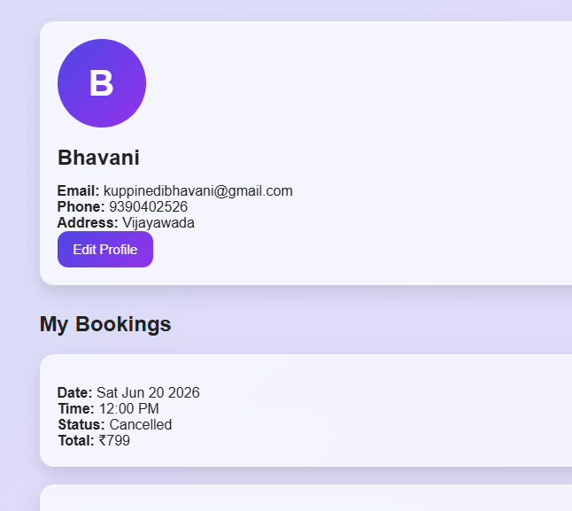
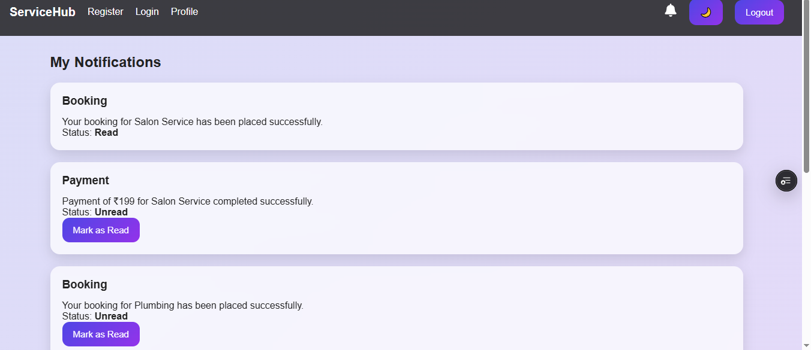

# ServiceHub – Full Stack Service Booking Platform

ServiceHub is a full-stack web application where users can browse services, book appointments, make secure payments, and manage bookings. The platform includes user authentication, payment integration, notifications, profile management, admin dashboard, and provider dashboard.

## Links
   - Github repo link:https://github.com/kuppinedibhavani-dev/Service_Booking_Platform_w7
   - Vercel link:https://servicebookingplatformw7.vercel.app/
   - Render link:https://service-booking-platform-w7-3.onrender.com

## Screenshots
   -Home Page:
   -Service Details:
   -Booking Page:
   -Payment Page:
   -Profile Page:
   -Notifications Page:

## Features

### User Features
- User Registration & Login
- JWT Authentication
- View all available services
- Search and filter services
- View service details
- Book services with calendar and time slot picker
- Secure payment using Razorpay
- Payment verification
- Notifications system
- Profile editing
- Booking history
- Cancel bookings
- Dark/Light mode

### Admin Features
- Manage services
- Delete services
- View all services

### Provider Features
- View assigned bookings
- Accept bookings
- Reject bookings

---

## Tech Stack

### Frontend
- React.js
- React Router DOM
- Axios
- React Calendar
- React Icons
- React Toastify

### Backend
- Node.js
- Express.js
- MongoDB
- Mongoose
- JWT Authentication
- bcryptjs

### Payment Gateway
- Razorpay

### Deployment
- Frontend: Vercel
- Backend: Render
- Database: MongoDB Atlas

---

## Project Structure

service-booking-platform/
│
├── backend/
│ ├── controllers/
│ ├── models/
│ ├── routes/
│ ├── middleware/
│ ├── server.js
│
├── frontend/
│ ├── src/
│ │ ├── components/
│ │ ├── pages/
│ │ ├── services/
│ │ ├── App.js
│ │ ├── index.css
│
└── README.md

---

## API Routes
# Authentication

POST /api/auth/register
POST /api/auth/login
GET /api/auth/profile
PUT /api/auth/profile

# Services

GET /api/services
GET /api/services/:id
POST /api/services
PUT /api/services/:id
DELETE /api/services/:id

# Bookings

POST /api/bookings
GET /api/bookings/mybookings
DELETE /api/bookings/:id

# Payments

POST /api/payments/create
POST /api/payments/verify

# Notifications

GET /api/notifications
PUT /api/notifications/read/:id

# Payment Flow

Book Service
→ Create Razorpay Order
→ Open Razorpay Checkout
→ Complete Payment
→ Verify Signature
→ Update Payment Status
→ Confirm Booking
→ Generate Notification

